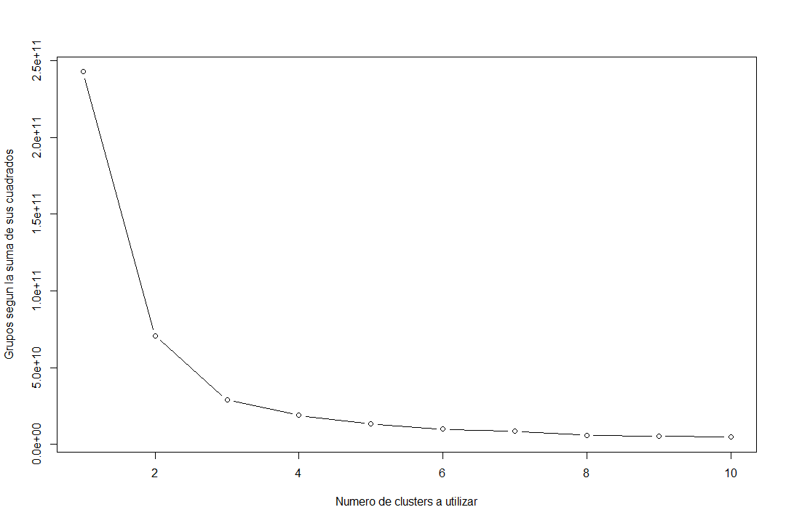
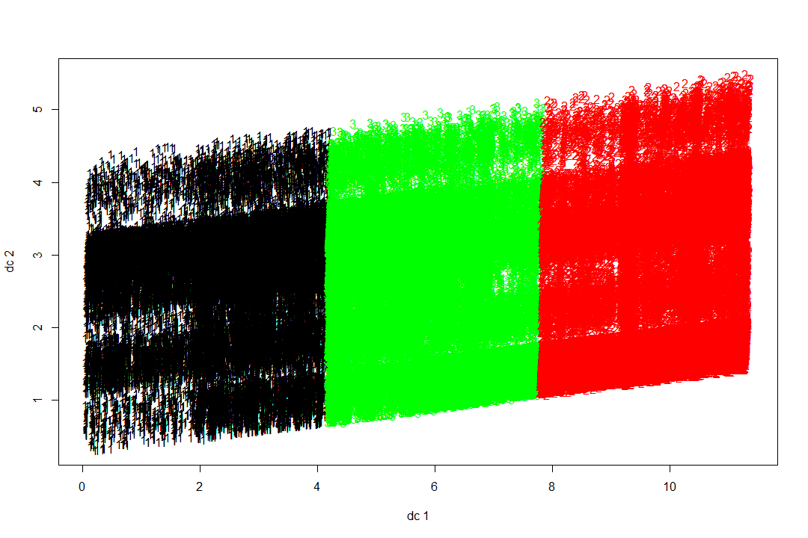
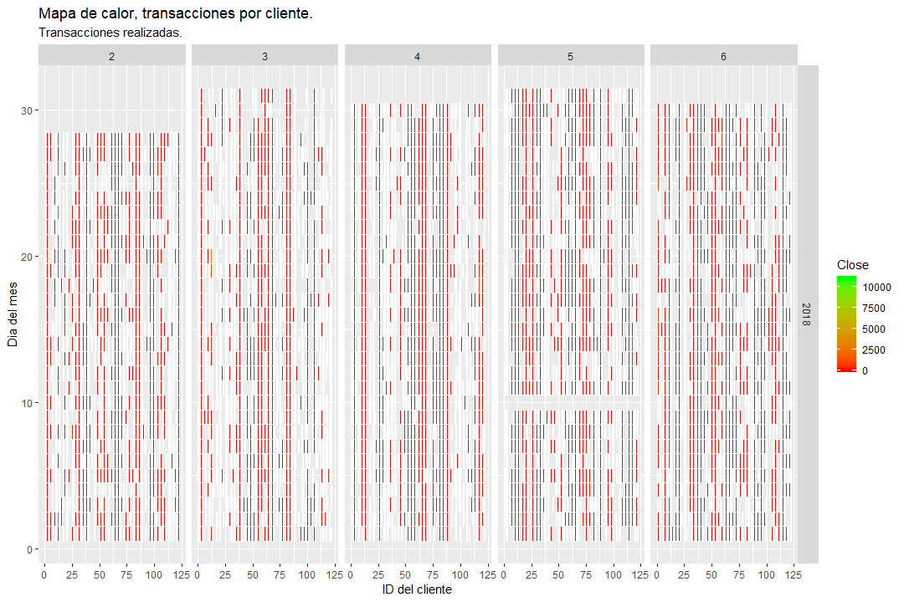
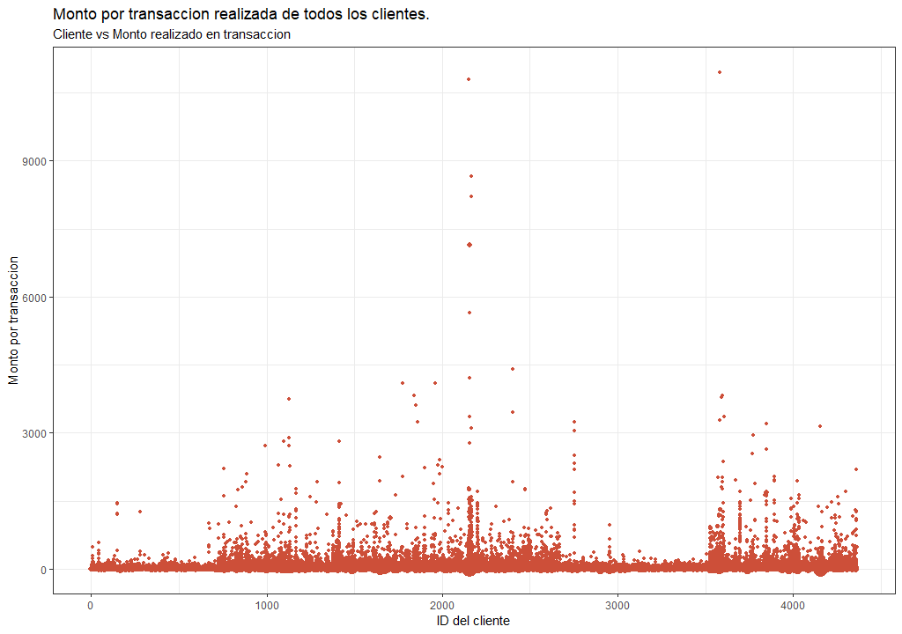
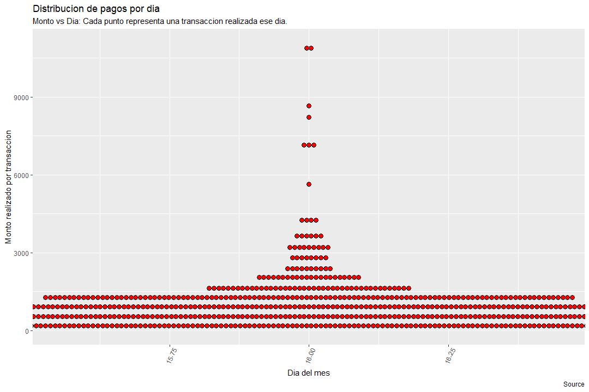

```{r setup, include=FALSE}

for (libreria in c("shiny","flexdashboard","class","caret","stringr","dplyr","tidyr","ggplot2","fpc","scales", "zoo","png")) {
  if (!require(libreria, character.only=T)) {
    install.packages(libreria, repos = "http://cran.us.r-project.org")
    library(libreria, character.only=T)
  }
}


Datos <- read.csv("./Database.csv", stringsAsFactors = F)
Datos$Cuenta <- as.numeric(gsub("Cliente"," ",Datos$Cuenta))
DatosLimpios <- Datos %>% separate(Fecha, c("Dia", "Mes","Year"), sep = "/")
DatosLimpios$Dia <- as.numeric(DatosLimpios$Dia)
DatosLimpios$Mes <- as.numeric(DatosLimpios$Mes)
DatosLimpios$Year <- as.numeric(DatosLimpios$Year)
DatosLimpios$TipoCompra <- as.numeric(factor(DatosLimpios$Segmento))

NoRecurrentes <- read.csv("./NoRecurrentes.csv", stringsAsFactors = F)
nombres<-rownames(NoRecurrentes)
DatosLimpios2 <- subset(DatosLimpios, Segmento != nombres)

```


Ventana de Banco
=======================================================================
Row
-----------------------------------------------------------------------
La siguiente informacion contiene el resumen de todos los datos contenidos en la base de datos:
```{r}
summary(DatosLimpios)
```

Gasto mas comun de todos los usuarios:
```{r}
GastoMasComun <- tail(names(sort(table(DatosLimpios$Segmento))), 1)
GastoMasComun
```

El lugar donde comunmente se gasta por todos los usuarios:
```{r}
LugarGastoMasComun <- tail(names(sort(table(DatosLimpios$Lugar))), 1)
LugarGastoMasComun
```


Row {.tabset .tabset-fade}
-----------------------------------------------------------------------

### Cantidad de Clusters
Se utiliza el metodo de la silueta para determinar la cantidad optima de clusters a realizar. En este caso la cantidad de clusters se escoge de manera visual.
```{r}

```

### Clusters
Los datos se agrupan por medio del metodo no supervisado conocido como "Clustering":
```{r}

```


### Mapa de calor
Mapa de calor el cual muestra las transacciones diarias realizadas por
usuarios.
```{r}

```


### Monto por transaccion
Diagrama de puntos el cual muestra cada pago individual realizado por todos los clientes.
```{r}

```


### Pagos por dia
Diagrama de puntos el cual muestra la distribucion de los dias en los cuales se realizaron pagos vs la cantidad realizada por cada transaccion.
```{r}

```


Ventana de Usuario
=======================================================================
```{r}
inputPanel(
  numericInput("ID", label = "Ingrese la ID del cliente:", 1, min = 1, max = 178724),
  
  numericInput("Presupuesto", label = "Ingrese el presupuesto mensual:", 2500)
  
)
```


Row {.tabset .tabset-fade}
-----------------------------------------------------------------------


### Knn - Matriz de confusion
Aprendizaje de maquinas utilizando Knn 
```{r, eval = FALSE, echo = TRUE}
set.seed(123)
porciento <- 65/100 
muestra<-sample(1:nrow(DatosLimpios2),porciento*nrow(DatosLimpios2))
TrainSet<-DatosLimpios2[muestra,] 
TestSet<-DatosLimpios2[-muestra,] 

predKnn<-knn(TrainSet[,c(1,5,8)],TestSet[,c(1,5,8)],as.factor(TrainSet$Dia),k=3)
cfm<-confusionMatrix(as.factor(TestSet$Dia),predKnn)
cfm
```

```{r}
knitr::include_graphics("./images/Knn.png")
knitr::include_graphics("./images/MatrizConfusion.png")
```


### Modelo Multilineal
Aprendizaje de maquinas utilizando un modelo multilineal
```{r, eval = FALSE, echo = TRUE}
modeloLinealMulti<-lm(Dia~Cuenta+Mes+TipoCompra , data = TrainSet)
summary(modeloLinealMulti)
prediccion<-predict(modeloLinealMulti,newdata = TestSet[,c(1,5,8)])
prediccion
dif<-abs(prediccion-TestSet$Dia)
dif
```

Tabla de diferencias entre algunos de los valores reales y los predichos por el modelo.
```{r}
renderTable({
  ResultadosMulti <- read.csv("./ResultadosMulti.csv", stringsAsFactors = F)
  data1<-ResultadosMulti[1:10,]
  data2<-ResultadosMulti[11:20,]
  data3<-ResultadosMulti[21:30,]
  data4<-ResultadosMulti[31:40,]
  df<-data.frame(data1,data2,data3,data4)
  head(df)
})
```


Row
-----------------------------------------------------------------------
Listado de los lugares mas comunes del usuario:
```{r}
renderText({
  IDcliente <- input$ID
  DatosIndividuales <- subset(DatosLimpios[,c(1:7)], DatosLimpios$Cuenta == IDcliente)
  ListaValores <- names(sort(table(DatosIndividuales$Segmento), decreasing=TRUE)[1:4])  
  paste0("#1:  ", ListaValores[1], ";   ",
         "#2:  ", ListaValores[2], ";   ",
         "#3:  ", ListaValores[3], ";   ",
         "#4:  ", ListaValores[4])
  
})
```


Tabla del rango de dias a realizar los pagos de los primeros 4 gastos mas comunes.
```{r}

renderTable({
  IDcliente <- input$ID
  DatosIndividuales <- subset(DatosLimpios[,c(1:7)], DatosLimpios$Cuenta == IDcliente)
  ListaValores <- names(sort(table(DatosIndividuales$Segmento), decreasing=TRUE)[1:4])
  Valor1 <- DatosIndividuales$Segmento == ListaValores[1] 
  Valor2 <- DatosIndividuales$Segmento == ListaValores[2] 
  Valor3 <- DatosIndividuales$Segmento == ListaValores[3] 
  Valor4 <- DatosIndividuales$Segmento == ListaValores[4] 
  ValoresMasComunes <- Valor1 | Valor2 | Valor3 | Valor4
  TablaPrediccion <- DatosIndividuales[ValoresMasComunes,]
  DiaPago = c()
  DiaPagoMax = c()
  DiaPagoMin = c()
  for(i in ListaValores[1:4])
  {
    ListaTemp <- TablaPrediccion$Segmento == i
    DiaPago[i] <- round(mean(TablaPrediccion[ListaTemp,]$Dia))
    Desviacion <- sd(TablaPrediccion[ListaTemp,]$Dia)
    DiaPagoMax[i] <- round(DiaPago[i] + Desviacion)
    DiaPagoMin[i] <- round(DiaPago[i] - Desviacion)
  }
  DiaPago[is.na(DiaPago)]<-15
  DiaPagoMax[is.na(DiaPagoMax)]<-17
  DiaPagoMin[is.na(DiaPagoMin)]<-13
  InfoDiaPago <- data.frame(as.numeric(DiaPago),as.numeric(DiaPagoMax),as.numeric(DiaPagoMin))
  colnames(InfoDiaPago) <- c("Dia promedio", "Dia maximo", "Dia minimo")
  InfoDiaPago[InfoDiaPago<=1]<-1
  InfoDiaPago[InfoDiaPago>=31]<-31
  head(InfoDiaPago)
  
})
```


Resultados del presupuesto versus los gastos del mes.
```{r}

renderTable({
  IDcliente <- input$ID
  PresupuestoMensual <- input$Presupuesto
  DatosIndividuales <- subset(DatosLimpios[,c(1:7)], DatosLimpios$Cuenta == IDcliente)

  
  Mes2 <- subset(DatosIndividuales, DatosIndividuales$Mes == 2)
  Suma2 <- sum(Mes2$Mes)
  Mes3 <- subset(DatosIndividuales, DatosIndividuales$Mes == 3)
  Suma3 <- sum(Mes3$Mes)
  Mes4 <- subset(DatosIndividuales, DatosIndividuales$Mes == 4)
  Suma4 <- sum(Mes4$Mes)
  Mes5 <- subset(DatosIndividuales, DatosIndividuales$Mes == 5)
  Suma5 <- sum(Mes5$Mes)
  Mes6 <- subset(DatosIndividuales, DatosIndividuales$Mes == 6)
  Suma6 <- sum(Mes6$Mes)
  
  res2 <- PresupuestoMensual - Suma2
  res3 <- PresupuestoMensual - Suma3
  res4 <- PresupuestoMensual - Suma4
  res5 <- PresupuestoMensual - Suma5
  res6 <- PresupuestoMensual - Suma6
  
  Mes <- c("Mes 2", "Mes 3", "Mes 4", "Mes 5", "Mes 6")
  Dinero <- c(res2,res3,res4,res5,res6)
  
  InfoPresupuesto <- data.frame(Mes,Dinero)
  head(InfoPresupuesto)
})
```


Row {.tabset .tabset-fade}
-----------------------------------------------------------------------

### Gastos totales
```{r}
renderPlot({
  IDcliente <- input$ID
  DatosIndividuales <- subset(DatosLimpios[,c(1:7)], DatosLimpios$Cuenta == IDcliente)
  pie(table(DatosIndividuales$Segmento), col = topo.colors(15), main = "Lugares de consumo")
})
```

### Mes 2
```{r}
renderPlot({
  IDcliente <- input$ID
  DatosIndividuales <- subset(DatosLimpios[,c(1:7)], DatosLimpios$Cuenta == input$ID)
  TempDF <- subset(DatosIndividuales, DatosIndividuales$Mes == 2)  
  tryCatch(pie(table(TempDF$Segmento),col = topo.colors(15), main = paste ("Gastos del mes:", 2)), error = function(e){stop("No hay datos para este mes")})
})
```

### Mes 3
```{r}
renderPlot({
  IDcliente <- input$ID
  DatosIndividuales <- subset(DatosLimpios[,c(1:7)], DatosLimpios$Cuenta == input$ID)
  TempDF <- subset(DatosIndividuales, DatosIndividuales$Mes == 3)  
  tryCatch(pie(table(TempDF$Segmento),col = topo.colors(15), main = paste ("Gastos del mes:", 3)), error = function(e){stop("No hay datos para este mes")})
})
```

### Mes 4
```{r}
renderPlot({
  IDcliente <- input$ID
  DatosIndividuales <- subset(DatosLimpios[,c(1:7)], DatosLimpios$Cuenta == input$ID)
  TempDF <- subset(DatosIndividuales, DatosIndividuales$Mes == 4)  
  tryCatch(pie(table(TempDF$Segmento),col = topo.colors(15), main = paste ("Gastos del mes:", 4)), error = function(e){stop("No hay datos para este mes")})
})
```

### Mes 5
```{r}
renderPlot({
  IDcliente <- input$ID
  DatosIndividuales <- subset(DatosLimpios[,c(1:7)], DatosLimpios$Cuenta == input$ID)
  TempDF <- subset(DatosIndividuales, DatosIndividuales$Mes == 5)  
  tryCatch(pie(table(TempDF$Segmento),col = topo.colors(15), main = paste ("Gastos del mes:", 5)), error = function(e){stop("No hay datos para este mes")})
})
```

### Mes 6
```{r}
renderPlot({
  IDcliente <- input$ID
  DatosIndividuales <- subset(DatosLimpios[,c(1:7)], DatosLimpios$Cuenta == input$ID)
  TempDF <- subset(DatosIndividuales, DatosIndividuales$Mes == 6)  
  tryCatch(pie(table(TempDF$Segmento),col = topo.colors(15), main = paste ("Gastos del mes:", 6)), error = function(e){stop("No hay datos para este mes")})
  
})
```


Informacion
=======================================================================

####Jaime Pérez, 15279
####Rodrigo Gordillo, 12256 
####Luis Contreras, 15341
####Rodolfo Grajeda, 15016

